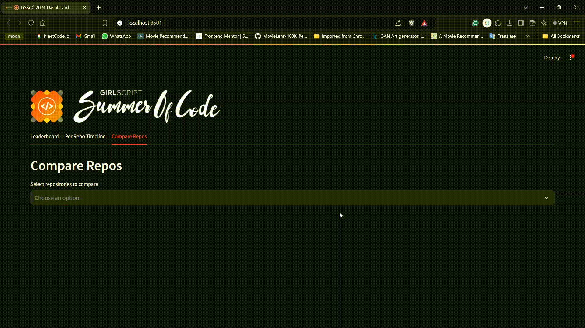

# GSSoC-Extd 2024 Project Tracker 🚀

## Table of Contents

- [About](#-about)
- [Features](#-features)
	- [Leaderboard](#1-leaderboard-)
	- [Per-Repo Timeline](#2-per-repo-timeline-)
	- [Project Comparison](#3-project-comparison-)
- [How It Works](#-how-it-works)
- [Getting Started](#-getting-started)
- [Featured Projects](#-featured-projects)
- [License](#-license)
- [Acknowledgements](#-acknowledgements)

## 🌟 About

Welcome to the GSSoC-Extd 2024 Project Tracker! This dynamic dashboard is your one-stop solution for tracking and comparing different projects participating in GSSoC-Extd 2024. Stay up-to-date with real-time project metrics and visualize progress like never before!

## 🎯 Features

### 1. Leaderboard 🏆

- View overall project gains rankings
- Track progress in the last 24 hours and weekly
- Top 10 projects across gains in various metrics:
  - Stars ⭐
  - Forks 🍴
  - Watchers 👀
  - Contributors 👥
  - And more!

### 2. Per-Repo Timeline 📈

- Visualize the progression of each feature for individual repositories
- Track metrics over time with interactive charts

### 3. Project Comparison 🔍

- Compare 2 or more repos using stunning radar charts
- Analyze across 5 key metrics for comprehensive insights

## 🛠 How It Works

1. Data is fetched nightly (up to 12 AM) from the GitHub API for all listed projects
2. Our Streamlit dashboard processes the data to generate insightful visualizations
3. Users can interact with the dashboard to explore project metrics and comparisons

## 🚀 Getting Started

Visit our live dashboard: [GSSoC-Extd 2024 Project Tracker](https://gsoc2024-extd-tracker.streamlit.app/)

## 🌟 Featured Projects

Don't forget to check out these amazing projects:

1. [NewsAI](https://github.com/Multiverse-of-Projects/NewsAI) - An AI-powered news aggregator and analyzer
2. [Face Recognition](https://github.com/devasy23/facerec) - Cutting-edge facial recognition technology

<!-- ## 🤝 Contributing

We welcome contributions! Please see our [Contributing Guidelines](CONTRIBUTING.md) for more information. -->

## 📝 License

This project is licensed under the [BSD3 License](LICENSE).

## 🙏 Acknowledgements

- GSSoC-Extd 2024 organizers and participants
- GitHub API for providing the data
- Streamlit for the amazing dashboard framework

---

Made with ❤️ for the open-source community
